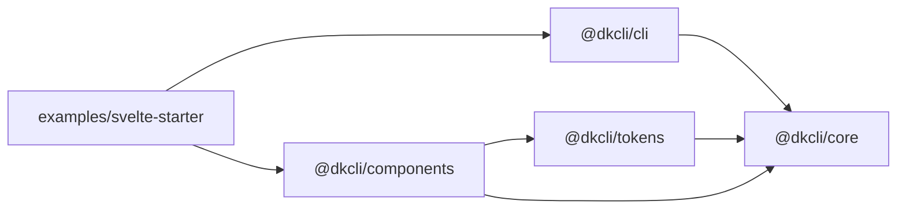
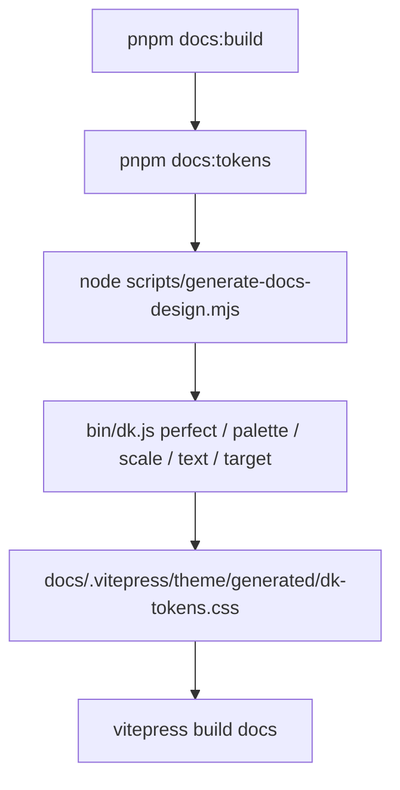

# Repository Tour

DesignKit is split so the math can stay deterministic while framework packages stay ergonomic.

## Root Workspace

- `src/bin/dk.ts` is the publishable CLI entrypoint compiled into `dist/bin/dk.js`.
- `bin/dk.js` is the source-owned local wrapper used during development and by these docs.
- `src/lib/dk` contains CLI-facing deterministic helpers and command implementations.
- `src/lib/dkcms` contains typed payload helpers for the hosted DKCMS command group.
- `packages/` contains public package outputs.
- `examples/svelte-starter` verifies the published tarballs in a small consumer app.

## Public Packages

## Determinism Rules

Core design functions should remain deterministic and side-effect free. Network or hosted-service behavior belongs at the CLI boundary or in `src/lib/dkcms`, not inside the reusable math modules.

## Docs Build

