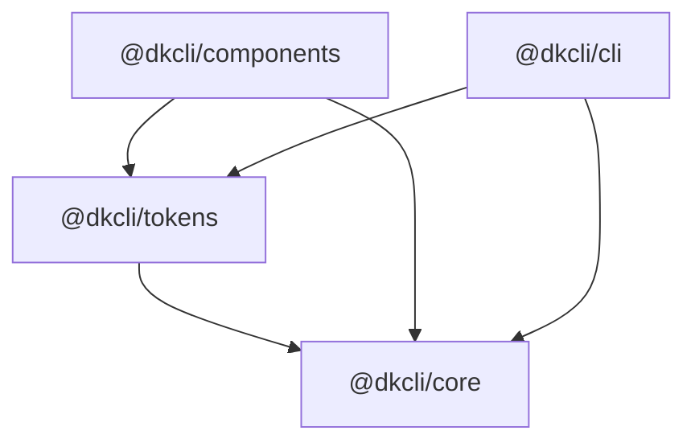

# Packages

DesignKit ships as a small public package system rather than one overloaded bundle.

## Dependency Direction

## Package Responsibilities

- `@dkcli/core`: deterministic math, proof contracts, audit helpers, and recipe logic.
- `@dkcli/tokens`: theme compilation, semantic aliasing, CSS output, and JSON token bundles.
- `@dkcli/components`: Svelte 5 component APIs, accessible behavior primitives, and recipe-backed rendering.
- `@dkcli/cli`: source-owned command line access to all of the above.

## Why The Split Matters

The split keeps heavy calculations out of render paths, gives component consumers stable CSS/token artifacts, and makes the proof layer testable without a browser.
